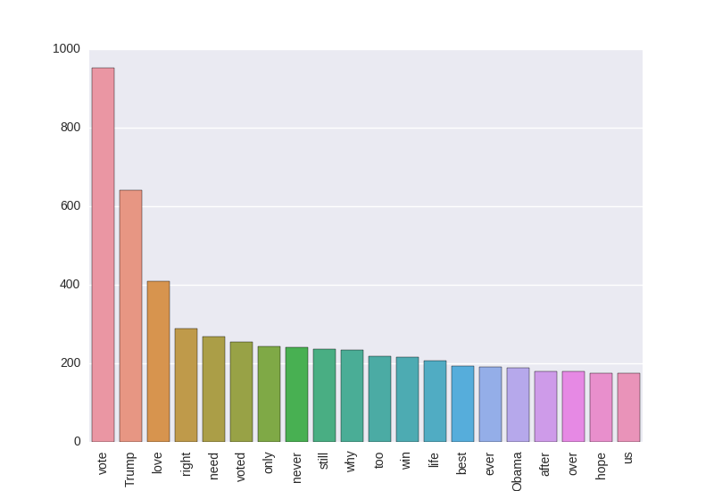

# Bar plot of the 20 most frequent words on Twitter, November 8, 2016, 4-4:30 pm EST

The [bar plot](Plot.png) shows the 20 most frequent words on Twitter on the day of the United States presidential election, November 8, 2016, 4-4:30 pm EST. As visible, the most frequent word in tweets were about the elections: vote, voted, Trump and Obama are among the words that occurred in the tweets with the highest frequency. These results are filtered to exclude the [100 most frequent English words](www.wordfrequency.info), and a few additions which include prepositions, forms of 'be' denoted by rank 0 at the end of the [word frequency list](wordfreq.txt),
 

